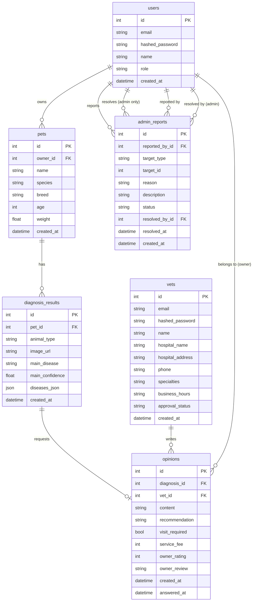

# 🚀 GANADI 개발 진행 상황

**작성일**: 2026-04-16  
**최종 업데이트**: Phase 2 완료 (관리자·수의사 기능 구현)

---

## 📋 개발 단계 개요

### Phase 1: 기반 시스템 구축 (완료)
- ✅ 이미지 영구 저장 (S3/로컬)
- ✅ SQLite → MySQL 전환
- ✅ 기본 API 구조 (사용자, 반려동물, 진단)
- ✅ AI 모델 연동

### Phase 2: 관리자·수의사 기능 (완료)
- ✅ 관리자 대시보드 및 관리 기능
- ✅ 수의사 대시보드 및 의견서 시스템
- ✅ 수의사 회원가입·승인 프로세스
- ✅ 평점·리뷰 시스템 (백엔드)
- ✅ 신고 시스템 (백엔드)

---

## 🔧 Phase 2: 상세 개발 내역

### 1. 데이터베이스 확장

#### 1-1. 새로운 테이블: `admin_reports`

**목적**: 사용자 신고 시스템

```sql
CREATE TABLE admin_reports (
    id INT PRIMARY KEY AUTO_INCREMENT,
    reported_by_id INT NOT NULL,
    target_type ENUM('user', 'vet', 'opinion', 'diagnosis'),
    target_id INT NOT NULL,
    reason VARCHAR(255) NOT NULL,
    description TEXT,
    status ENUM('pending', 'reviewed', 'resolved', 'rejected') DEFAULT 'pending',
    resolved_by_id INT,
    resolved_at DATETIME,
    created_at DATETIME DEFAULT CURRENT_TIMESTAMP,
    
    FOREIGN KEY (reported_by_id) REFERENCES users(id),
    FOREIGN KEY (resolved_by_id) REFERENCES users(id)
);
```

**필드 설명**:
- `target_type`: 신고 대상 유형
- `target_id`: 신고 대상 ID
- `reason`: 신고 사유 (필수)
- `description`: 상세 설명 (선택)
- `status`: 처리 상태
- `resolved_by_id`: 처리한 관리자
- `resolved_at`: 처리 시간

---

#### 1-2. `opinions` 테이블 확장

**추가된 컬럼**:

```sql
ALTER TABLE opinions ADD COLUMN service_fee INT DEFAULT NULL COMMENT '수수료(원)';
ALTER TABLE opinions ADD COLUMN owner_rating INT DEFAULT NULL COMMENT '반려인 평점(1-5)';
ALTER TABLE opinions ADD COLUMN owner_review TEXT DEFAULT NULL COMMENT '반려인 후기';
```

**목적**:
- `service_fee`: 수의사가 설정한 의견서 작성 수수료
- `owner_rating`: 반려인이 남긴 평점 (1-5점)
- `owner_review`: 반려인이 남긴 후기

---

#### 1-3. `vets` 테이블 확장

**추가된 컬럼**:

```sql
ALTER TABLE vets ADD COLUMN approval_status 
    ENUM('pending', 'approved', 'rejected') DEFAULT 'pending';
```

**목적**: 수의사 가입 시 관리자 승인 프로세스

**상태 설명**:
- `pending`: 승인 대기 (신규 가입 기본값)
- `approved`: 승인됨 (모든 기능 사용 가능)
- `rejected`: 거절됨

---

#### 1-4. 마이그레이션

**파일**: `backend/alembic/versions/c45f7a8d9e2b_add_admin_reports_and_opinion_fee.py`

```bash
# 생성
alembic revision --autogenerate -m "add admin reports and opinion fee rating"

# 실행
alembic upgrade head

# 결과
✅ admin_reports 테이블 생성
✅ opinions 테이블 컬럼 추가 (service_fee, owner_rating, owner_review)
✅ vets 테이블 컬럼 추가 (approval_status)
```

---

### 2. 백엔드 API 개발

#### 2-1. 관리자 API (`backend/app/routers/admin.py`)

##### 📊 대시보드 통계 API

```http
GET /api/admin/stats
Authorization: Bearer {admin_token}
```

**응답**:
```json
{
  "total_users": 150,
  "total_vets": 25,
  "total_diagnoses": 1234,
  "total_opinions": 456,
  "pending_reports": 3,
  "revenue_this_month": 1250000,
  "user_growth": [
    {"month": "2026-01", "count": 45},
    {"month": "2026-02", "count": 62}
  ],
  "diagnosis_by_species": [
    {"species": "dog", "count": 800},
    {"species": "cat", "count": 434}
  ],
  "top_diseases": [
    {"disease": "피부병", "count": 234},
    {"disease": "안과질환", "count": 189}
  ]
}
```

**기능**:
- 사용자·수의사·진단·의견서 총 개수
- 대기 중 신고 개수
- 이번 달 총 수익 (의견서 수수료 합계)
- 월별 사용자 증가 추이
- 동물 종별 진단 건수
- 질병 분포 (상위 질병)

---

##### 👥 사용자 관리 API

**1) 사용자 목록 조회**

```http
GET /api/admin/users?skip=0&limit=50
Authorization: Bearer {admin_token}
```

**응답**:
```json
{
  "total": 150,
  "users": [
    {
      "id": 1,
      "email": "user@example.com",
      "name": "홍길동",
      "created_at": "2026-01-15T10:30:00",
      "pets_count": 2,
      "diagnoses_count": 5
    }
  ]
}
```

**2) 사용자 삭제**

```http
DELETE /api/admin/users/{user_id}
Authorization: Bearer {admin_token}
```

**응답**:
```json
{"message": "사용자가 삭제되었습니다."}
```

---

##### 🩺 수의사 관리 API

**1) 수의사 목록 조회**

```http
GET /api/admin/vets?skip=0&limit=50
Authorization: Bearer {admin_token}
```

**응답**:
```json
{
  "total": 25,
  "vets": [
    {
      "id": 1,
      "email": "vet@hospital.com",
      "name": "김수의사",
      "hospital_name": "행복동물병원",
      "approval_status": "pending",
      "created_at": "2026-03-10T14:20:00",
      "opinions_count": 0
    }
  ]
}
```

**2) 수의사 승인/거절**

```http
PUT /api/admin/vets/{vet_id}/approval
Authorization: Bearer {admin_token}
Content-Type: application/json

{
  "approval_status": "approved"
}
```

**가능한 값**: `approved`, `rejected`

**3) 수의사 삭제**

```http
DELETE /api/admin/vets/{vet_id}
Authorization: Bearer {admin_token}
```

---

##### 🚨 신고 관리 API

**1) 신고 목록 조회**

```http
GET /api/admin/reports?status=pending&skip=0&limit=50
Authorization: Bearer {admin_token}
```

**쿼리 파라미터**:
- `status`: `pending`, `reviewed`, `resolved`, `rejected`, `all` (기본값: `all`)

**응답**:
```json
{
  "total": 3,
  "reports": [
    {
      "id": 1,
      "target_type": "opinion",
      "target_id": 123,
      "reason": "부적절한 내용",
      "description": "의학적 근거 없는 치료법 제시",
      "status": "pending",
      "reported_by": {
        "id": 45,
        "name": "신고자",
        "email": "reporter@example.com"
      },
      "created_at": "2026-04-15T09:30:00"
    }
  ]
}
```

**2) 신고 처리**

```http
PUT /api/admin/reports/{report_id}/resolve
Authorization: Bearer {admin_token}
Content-Type: application/json

{
  "status": "resolved"
}
```

**가능한 값**: `reviewed`, `resolved`, `rejected`

**자동 기록**:
- `resolved_by_id`: 현재 로그인한 관리자 ID
- `resolved_at`: 처리 시각

---

#### 2-2. 수의사 API 확장 (`backend/app/routers/vets.py`)

##### 📊 수의사 대시보드 통계 API

```http
GET /api/vets/dashboard-summary
Authorization: Bearer {vet_token}
```

**응답**:
```json
{
  "pending_count": 3,
  "completed_total": 45,
  "completed_last_7_days": 5,
  "avg_rating": 4.7,
  "review_count": 32,
  "revenue_this_month": 450000,
  "monthly_requests": [
    {"month": "2026-01", "count": 12},
    {"month": "2026-02", "count": 15}
  ],
  "disease_breakdown": [
    {"disease": "피부병", "count": 15},
    {"disease": "안과질환", "count": 10}
  ]
}
```

**기능**:
- 대기 중 의견 요청 수
- 총 완료 건수 / 최근 7일 완료 건수
- 평균 평점 및 리뷰 수
- 이번 달 수익 (service_fee 합계)
- 월별 요청 추이
- 질병별 분류

---

##### 👤 수의사 프로필 API

**1) 프로필 조회**

```http
GET /api/vets/profile
Authorization: Bearer {vet_token}
```

**응답**:
```json
{
  "id": 1,
  "email": "vet@hospital.com",
  "name": "김수의사",
  "hospital_name": "행복동물병원",
  "hospital_address": "서울시 강남구...",
  "phone": "02-1234-5678",
  "specialties": "피부과, 안과",
  "business_hours": "평일 09:00-18:00, 주말 10:00-15:00",
  "approval_status": "approved",
  "created_at": "2026-03-10T14:20:00"
}
```

**2) 프로필 수정**

```http
PUT /api/vets/profile
Authorization: Bearer {vet_token}
Content-Type: application/json

{
  "hospital_name": "새이름동물병원",
  "hospital_address": "서울시 서초구...",
  "phone": "02-9999-8888",
  "specialties": "내과, 외과",
  "business_hours": "평일 08:00-20:00"
}
```

**수정 가능 필드**:
- `hospital_name`, `hospital_address`, `phone`
- `specialties`, `business_hours`

**수정 불가 필드**:
- `email`, `name`, `approval_status`

---

#### 2-3. 의견서 API 확장 (`backend/app/routers/opinions.py`)

##### ⭐ 평점·리뷰 제출 API

```http
POST /api/opinions/{opinion_id}/rate
Authorization: Bearer {user_token}
Content-Type: application/json

{
  "rating": 5,
  "review": "친절하고 상세한 답변 감사합니다!"
}
```

**제약사항**:
- 의견서를 받은 반려인만 평가 가능
- 이미 평가한 경우 업데이트
- `rating`: 1-5 (필수)
- `review`: 텍스트 (선택)

**응답**:
```json
{
  "id": 123,
  "owner_rating": 5,
  "owner_review": "친절하고 상세한 답변 감사합니다!",
  "updated_at": "2026-04-16T15:30:00"
}
```

---

##### 📄 수의사별 의견 요청 목록 API

```http
GET /api/opinions/vet-requests?status=pending&skip=0&limit=20
Authorization: Bearer {vet_token}
```

**쿼리 파라미터**:
- `status`: `pending`, `completed`, `all` (기본값: `all`)

**응답**:
```json
{
  "total": 3,
  "opinions": [
    {
      "id": 123,
      "diagnosis_id": 456,
      "pet_name": "뽀삐",
      "owner_name": "홍길동",
      "symptom_memo": "피부에 붉은 반점",
      "created_at": "2026-04-16T10:00:00",
      "answered_at": null,
      "content": null,
      "recommendation": null,
      "visit_required": null,
      "service_fee": null,
      "owner_rating": null,
      "owner_review": null,
      "diagnosis": {
        "animal_type": "dog",
        "main_disease": "피부병",
        "main_confidence": 0.87,
        "image_url": "https://..."
      }
    }
  ]
}
```

**기능**:
- 로그인한 수의사에게 배정된 의견 요청만 조회
- 진단 정보 및 이미지 포함
- 반려동물·반려인 정보 포함

---

### 3. 프론트엔드 개발

#### 3-1. API 모듈 추가

##### `frontend/src/api/admin.js` (신규)

```javascript
import api from './index';

export const adminAPI = {
  // 통계
  getDashboardStats: () => api.get('/admin/stats'),
  
  // 사용자 관리
  getUsers: (skip = 0, limit = 50) => 
    api.get('/admin/users', { params: { skip, limit }}),
  deleteUser: (userId) => api.delete(`/admin/users/${userId}`),
  
  // 수의사 관리
  getVets: (skip = 0, limit = 50) => 
    api.get('/admin/vets', { params: { skip, limit }}),
  updateVetApproval: (vetId, status) => 
    api.put(`/admin/vets/${vetId}/approval`, { approval_status: status }),
  deleteVet: (vetId) => api.delete(`/admin/vets/${vetId}`),
  
  // 신고 관리
  getReports: (status = 'all', skip = 0, limit = 50) => 
    api.get('/admin/reports', { params: { status, skip, limit }}),
  resolveReport: (reportId, status) => 
    api.put(`/admin/reports/${reportId}/resolve`, { status }),
};
```

---

##### `frontend/src/api/vets.js` (신규)

```javascript
import api from './index';

export const vetsAPI = {
  // 수의사 기본 정보
  getVetMe: () => api.get('/vets/me'),
  
  // 프로필
  getVetProfile: () => api.get('/vets/profile'),
  updateVetProfile: (data) => api.put('/vets/profile', data),
  
  // 대시보드 통계
  getVetDashboardSummary: () => api.get('/vets/dashboard-summary'),
};

// Named exports
export const getVetMe = vetsAPI.getVetMe;
export const getVetProfile = vetsAPI.getVetProfile;
export const updateVetProfile = vetsAPI.updateVetProfile;
export const getVetDashboardSummary = vetsAPI.getVetDashboardSummary;
```

---

##### `frontend/src/api/opinions.js` (신규)

```javascript
import api from './index';

export const opinionsAPI = {
  // 수의사 의견 요청 목록
  getVetOpinionRequests: (status = 'all', skip = 0, limit = 20) => 
    api.get('/opinions/vet-requests', { params: { status, skip, limit }}),
  
  // 의견서 조회
  getOpinionById: (id) => api.get(`/opinions/${id}`),
  
  // 의견서 제출
  submitOpinion: (id, data) => api.post(`/opinions/${id}/submit`, data),
  
  // 평점·리뷰 제출
  rateOpinion: (id, rating, review) => 
    api.post(`/opinions/${id}/rate`, { rating, review }),
};

// Named exports
export const getVetOpinionRequests = opinionsAPI.getVetOpinionRequests;
export const getOpinionById = opinionsAPI.getOpinionById;
export const submitOpinion = opinionsAPI.submitOpinion;
export const rateOpinion = opinionsAPI.rateOpinion;
```

---

#### 3-2. 관리자 대시보드 (`frontend/src/app/pages/AdminDashboard.tsx`)

##### 디자인 컨셉
- **스타일**: Figma 스타일의 미니멀한 UI
- **컬러**: 슬레이트(Slate) + 블루(Blue) 조합
- **레이아웃**: 왼쪽 사이드바 + 메인 컨텐츠
- **반응형**: 차트는 recharts 라이브러리 사용

##### UI 구조

```
┌─────────────────────────────────────────────────────┐
│ 사이드바            │  메인 컨텐츠                   │
│ (접기 가능)         │                               │
├─────────────────────┼───────────────────────────────┤
│ 🏠 GANADI           │  헤더: 관리자 대시보드         │
│                     │                               │
│ 📊 통계             │  [통계] [사용자] [수의사]     │
│ 👥 사용자 관리       │                               │
│ 🩺 수의사 관리       │  ... 탭별 컨텐츠 ...          │
│                     │                               │
│ 🚪 로그아웃         │                               │
└─────────────────────┴───────────────────────────────┘
```

##### 탭 1: 통계

**주요 지표 카드 (4개)**
```
┌─────────────┬─────────────┬─────────────┬─────────────┐
│ 총 사용자   │ 총 수의사   │ 총 진단     │ 이달 매출   │
│ 150명       │ 25명        │ 1,234건     │ ₩1,250,000  │
└─────────────┴─────────────┴─────────────┴─────────────┘
```

**차트 3개**
1. **사용자 증가 추이** (라인 차트)
   - X축: 월 (2026-01, 2026-02, ...)
   - Y축: 사용자 수
   - 데이터: `stats.user_growth`

2. **동물 종별 진단 건수** (바 차트)
   - X축: 동물 종 (강아지, 고양이, 새, 햄스터, ...)
   - Y축: 진단 건수
   - 데이터: `stats.diagnosis_by_species`

3. **질병 분포** (파이 차트)
   - 상위 5개 질병
   - 데이터: `stats.top_diseases`

**API 연동**:
```javascript
useEffect(() => {
  adminAPI.getDashboardStats().then(res => setStats(res.data));
}, []);
```

---

##### 탭 2: 사용자 관리

**테이블 구조**
```
┌────┬──────────────┬────────┬───────┬──────┬──────┬────────┐
│ ID │ 이메일       │ 이름   │ 가입일│ 반려│ 진단 │ 작업   │
│    │              │        │       │ 동물│ 건수 │        │
├────┼──────────────┼────────┼───────┼──────┼──────┼────────┤
│ 1  │user@ex.com   │홍길동  │01-15  │2마리 │5건   │[삭제]  │
│ 2  │park@ex.com   │박영희  │02-03  │1마리 │3건   │[삭제]  │
└────┴──────────────┴────────┴───────┴──────┴──────┴────────┘

총 150명 | 페이지: [1] [2] [3] ...
```

**기능**:
- 페이징: 50명씩
- 삭제 버튼: 확인 모달 → API 호출 → 목록 새로고침
- 정렬: ID, 가입일, 이메일

**API 연동**:
```javascript
const loadUsers = async () => {
  const res = await adminAPI.getUsers(currentPage * 50, 50);
  setUsers(res.data.users);
  setTotalUsers(res.data.total);
};

const handleDeleteUser = async (userId) => {
  if (confirm('정말 삭제하시겠습니까?')) {
    await adminAPI.deleteUser(userId);
    loadUsers();
  }
};
```

---

##### 탭 3: 수의사 관리

**테이블 구조**
```
┌────┬─────────────┬────────┬──────────┬────────┬──────┬────────────┐
│ ID │ 이메일      │ 이름   │ 병원명   │ 상태   │ 의견 │ 작업       │
│    │             │        │          │        │ 건수 │            │
├────┼─────────────┼────────┼──────────┼────────┼──────┼────────────┤
│ 1  │vet@hosp.com │김수의사│행복병원  │승인대기│0건   │[승인][거절]│
│ 2  │dr@pet.com   │이수의사│반려병원  │승인됨  │45건  │      [삭제]│
└────┴─────────────┴────────┴──────────┴────────┴──────┴────────────┘
```

**상태 뱃지**:
- `pending`: 🟡 승인 대기 (노란색)
- `approved`: 🟢 승인됨 (녹색)
- `rejected`: 🔴 거절됨 (빨간색)

**기능**:
- 승인/거절 버튼: 확인 → API → 상태 업데이트
- 삭제 버튼: 확인 모달
- 필터: 전체 / 승인 대기만

**API 연동**:
```javascript
const handleApproval = async (vetId, status) => {
  if (confirm(`수의사를 ${status === 'approved' ? '승인' : '거절'}하시겠습니까?`)) {
    await adminAPI.updateVetApproval(vetId, status);
    loadVets();
  }
};
```

---

#### 3-3. 수의사 대시보드 (`frontend/src/app/pages/VetDashboard.tsx`)

##### 디자인 컨셉
- **스타일**: Figma 스타일의 고급스러운 UI
- **컬러**: 슬레이트(Slate) + 스카이블루(Sky)
- **레이아웃**: 왼쪽 사이드바 + 메인 컨텐츠
- **특징**: 승인 대기 시 상단 배너 표시

##### UI 구조

```
┌─────────────────────────────────────────────────────┐
│ 사이드바            │  승인 대기 배너 (조건부)       │
│                     ├───────────────────────────────┤
│ 🩺 행복동물병원     │  헤더: 수의사 대시보드         │
│ 김수의사 원장       │                               │
│ ✅ 승인됨           │  [대기 중] [완료] [통계]      │
│                     │                               │
│ 📊 대시보드         │  ... 탭별 컨텐츠 ...          │
│ ⚙️ 병원 프로필      │                               │
│                     │                               │
│ 🚪 로그아웃         │                               │
└─────────────────────┴───────────────────────────────┘
```

##### 승인 대기 배너

```
┌─────────────────────────────────────────────────────┐
│ ⚠️ 승인 대기 중입니다.                              │
│ 관리자가 수의사 신청을 승인하면 모든 기능을 이용할  │
│ 수 있습니다. 승인 전에도 로그인·프로필 수정은       │
│ 가능합니다.                                         │
└─────────────────────────────────────────────────────┘
```

**표시 조건**: `approval_status === 'pending'`

---

##### 탭 1: 대기 중 의견 요청

**카드 레이아웃**
```
┌────────────────────────────────────────────────────────┐
│ 진단 #456  |  뽀삐 (강아지)  |  반려인: 홍길동        │
├────────────────────────────────────────────────────────┤
│ 주요 질환: 피부병 (87%)                                │
│ 증상 메모: 피부에 붉은 반점이 생겼어요                 │
│ 요청일: 2026-04-16 10:00                               │
├────────────────────────────────────────────────────────┤
│                                    [이미지 보기] [작성] │
└────────────────────────────────────────────────────────┘
```

**기능**:
- [이미지 보기]: 진단 이미지 모달 표시
- [작성]: `/vet/opinions/{opinionId}/write` 페이지 이동

**API 연동**:
```javascript
useEffect(() => {
  getVetOpinionRequests('pending').then(res => 
    setPendingOpinions(res.data.opinions)
  );
}, []);
```

---

##### 탭 2: 완료된 의견서

**카드 레이아웃**
```
┌────────────────────────────────────────────────────────┐
│ 진단 #123  |  나비 (고양이)  |  반려인: 박영희        │
├────────────────────────────────────────────────────────┤
│ 작성일: 2026-04-10 15:30  |  수수료: ₩10,000       │
│ 평점: ⭐⭐⭐⭐⭐ (5.0)                                    │
│ 후기: "친절하고 상세한 답변 감사합니다!"               │
├────────────────────────────────────────────────────────┤
│                                              [상세보기] │
└────────────────────────────────────────────────────────┘
```

**기능**:
- 평점·리뷰 표시
- [상세보기]: 의견서 전체 내용 모달

**API 연동**:
```javascript
useEffect(() => {
  getVetOpinionRequests('completed').then(res => 
    setCompletedOpinions(res.data.opinions)
  );
}, []);
```

---

##### 탭 3: 통계

**주요 지표 카드 (6개)**
```
┌──────────┬──────────┬──────────┬──────────┬──────────┬──────────┐
│ 대기 중  │ 총 완료  │ 최근7일  │ 평균평점 │ 리뷰수   │ 이달수익 │
│ 3건      │ 45건     │ 5건      │ 4.7⭐    │ 32개     │ ₩450,000 │
└──────────┴──────────┴──────────┴──────────┴──────────┴──────────┘
```

**차트 2개**
1. **월별 의견 요청 추이** (라인 차트)
   - X축: 월
   - Y축: 요청 건수
   - 데이터: `summary.monthly_requests`

2. **질병별 분류** (파이 차트)
   - 상위 5개 질병
   - 데이터: `summary.disease_breakdown`

**API 연동**:
```javascript
useEffect(() => {
  getVetDashboardSummary().then(res => setSummary(res.data));
}, []);
```

---

#### 3-4. 수의사 의견서 작성 (`frontend/src/app/pages/VetOpinionWrite.tsx`)

##### UI 구조

```
┌─────────────────────────────────────────────────────┐
│ ← 뒤로가기        의견서 작성                       │
├─────────────────────────────────────────────────────┤
│ 📋 진단 정보                                        │
│ ┌─────────────────────────────────────────────────┐ │
│ │ 반려동물: 뽀삐 (강아지)                         │ │
│ │ 반려인: 홍길동                                  │ │
│ │ AI 진단: 피부병 (87%)                           │ │
│ │ 증상 메모: "피부에 붉은 반점..."                │ │
│ │ 진단 이미지: [보기]                             │ │
│ └─────────────────────────────────────────────────┘ │
├─────────────────────────────────────────────────────┤
│ ✍️ 의견서 작성                                      │
│ ┌─────────────────────────────────────────────────┐ │
│ │ 종합 소견                                       │ │
│ │ ┌─────────────────────────────────────────────┐ │ │
│ │ │                                             │ │ │
│ │ │  (textarea)                                 │ │ │
│ │ │                                             │ │ │
│ │ └─────────────────────────────────────────────┘ │ │
│ │                                                 │ │
│ │ 권장 조치사항                                   │ │
│ │ ┌─────────────────────────────────────────────┐ │ │
│ │ │                                             │ │ │
│ │ │  (textarea)                                 │ │ │
│ │ │                                             │ │ │
│ │ └─────────────────────────────────────────────┘ │ │
│ │                                                 │ │
│ │ [ ] 직접 내원 필요                              │ │
│ │                                                 │ │
│ │ 수수료 (원): [_________]                        │ │
│ │                                                 │ │
│ │                           [취소] [제출]         │ │
│ └─────────────────────────────────────────────────┘ │
└─────────────────────────────────────────────────────┘
```

##### 폼 필드

| 필드 | 타입 | 필수 | 설명 |
|------|------|------|------|
| `content` | textarea | ✅ | 종합 소견 (최소 20자) |
| `recommendation` | textarea | ✅ | 권장 조치사항 (최소 10자) |
| `visit_required` | checkbox | ⭕ | 직접 내원 필요 여부 |
| `service_fee` | number | ✅ | 수수료 (원) |

##### 검증 규칙

```javascript
const validate = () => {
  if (!formData.content || formData.content.length < 20) {
    setError('종합 소견은 최소 20자 이상 작성해주세요.');
    return false;
  }
  
  if (!formData.recommendation || formData.recommendation.length < 10) {
    setError('권장 조치사항은 최소 10자 이상 작성해주세요.');
    return false;
  }
  
  if (!formData.service_fee || formData.service_fee < 0) {
    setError('수수료를 입력해주세요.');
    return false;
  }
  
  return true;
};
```

##### API 연동

```javascript
// 진단 정보 로드
useEffect(() => {
  getOpinionById(opinionId).then(res => setOpinion(res.data));
}, [opinionId]);

// 제출
const handleSubmit = async () => {
  if (!validate()) return;
  
  try {
    await submitOpinion(opinionId, formData);
    alert('의견서가 제출되었습니다.');
    navigate('/vet/dashboard');
  } catch (error) {
    setError('제출에 실패했습니다.');
  }
};
```

---

#### 3-5. 수의사 회원가입 (`frontend/src/app/pages/VetRegister.tsx`)

##### UI 구조

```
┌─────────────────────────────────────────────────────┐
│                   🩺 수의사 신청                    │
├─────────────────────────────────────────────────────┤
│                                                     │
│  이메일                                             │
│  ┌─────────────────────────────────────────────┐   │
│  │ user@example.com                            │   │
│  └─────────────────────────────────────────────┘   │
│                                                     │
│  비밀번호                                           │
│  ┌─────────────────────────────────────────────┐   │
│  │ ••••••••                                    │   │
│  └─────────────────────────────────────────────┘   │
│                                                     │
│  비밀번호 확인                                      │
│  ┌─────────────────────────────────────────────┐   │
│  │ ••••••••                                    │   │
│  └─────────────────────────────────────────────┘   │
│                                                     │
│  이름                                               │
│  ┌─────────────────────────────────────────────┐   │
│  │ 김수의사                                    │   │
│  └─────────────────────────────────────────────┘   │
│                                                     │
│  병원명                                             │
│  ┌─────────────────────────────────────────────┐   │
│  │ 행복동물병원                                │   │
│  └─────────────────────────────────────────────┘   │
│                                                     │
│                                     [신청하기]      │
│                                                     │
│  이미 계정이 있으신가요? [로그인]                   │
└─────────────────────────────────────────────────────┘
```

##### 성공 안내

```
┌─────────────────────────────────────────────────────┐
│                   ✅ 신청 완료!                     │
├─────────────────────────────────────────────────────┤
│                                                     │
│  수의사 신청이 완료되었습니다!                      │
│  관리자 승인 후 로그인하실 수 있습니다.             │
│  승인 상태는 이메일로 안내됩니다.                   │
│                                                     │
│                                     [로그인하기]    │
└─────────────────────────────────────────────────────┘
```

##### 폼 검증

```javascript
const validateForm = () => {
  // 이메일 형식
  const emailRegex = /^[^\s@]+@[^\s@]+\.[^\s@]+$/;
  if (!emailRegex.test(formData.email)) {
    setError('올바른 이메일 형식이 아닙니다.');
    return false;
  }
  
  // 비밀번호 길이
  if (formData.password.length < 8) {
    setError('비밀번호는 최소 8자 이상이어야 합니다.');
    return false;
  }
  
  // 비밀번호 확인
  if (formData.password !== formData.passwordConfirm) {
    setError('비밀번호가 일치하지 않습니다.');
    return false;
  }
  
  // 필수 필드
  if (!formData.name || !formData.hospital_name) {
    setError('모든 필드를 입력해주세요.');
    return false;
  }
  
  return true;
};
```

##### API 연동

```javascript
const handleSubmit = async (e) => {
  e.preventDefault();
  
  if (!validateForm()) return;
  
  const ok = await vetRegister({
    email: formData.email,
    password: formData.password,
    name: formData.name,
    hospital_name: formData.hospital_name,
  });
  
  if (ok) {
    setSuccess(true);
  }
};
```

---

#### 3-6. 수의사 프로필 (`frontend/src/app/pages/VetProfile.tsx`)

##### UI 구조

```
┌─────────────────────────────────────────────────────┐
│ ← 뒤로가기        병원 프로필 설정                  │
├─────────────────────────────────────────────────────┤
│ 기본 정보 (읽기 전용)                               │
│ ┌─────────────────────────────────────────────────┐ │
│ │ 이메일: vet@hospital.com                        │ │
│ │ 이름: 김수의사                                  │ │
│ │ 승인 상태: ✅ 승인됨                            │ │
│ └─────────────────────────────────────────────────┘ │
├─────────────────────────────────────────────────────┤
│ 병원 정보 (수정 가능)                               │
│ ┌─────────────────────────────────────────────────┐ │
│ │ 병원명                                          │ │
│ │ [행복동물병원                               ]  │ │
│ │                                                 │ │
│ │ 주소                                            │ │
│ │ [서울시 강남구...                           ]  │ │
│ │                                                 │ │
│ │ 전화번호                                        │ │
│ │ [02-1234-5678                               ]  │ │
│ │                                                 │ │
│ │ 진료 과목                                       │ │
│ │ [피부과, 안과                               ]  │ │
│ │                                                 │ │
│ │ 진료 시간                                       │ │
│ │ [평일 09:00-18:00, 주말 10:00-15:00         ]  │ │
│ │                                                 │ │
│ │                           [취소] [저장]         │ │
│ └─────────────────────────────────────────────────┘ │
└─────────────────────────────────────────────────────┘
```

##### API 연동

```javascript
// 프로필 로드
useEffect(() => {
  getVetProfile().then(res => {
    setProfile(res.data);
    setFormData({
      hospital_name: res.data.hospital_name || '',
      hospital_address: res.data.hospital_address || '',
      phone: res.data.phone || '',
      specialties: res.data.specialties || '',
      business_hours: res.data.business_hours || '',
    });
  });
}, []);

// 저장
const handleSave = async () => {
  try {
    await updateVetProfile(formData);
    alert('프로필이 업데이트되었습니다.');
    navigate('/vet/dashboard');
  } catch (error) {
    setError('업데이트에 실패했습니다.');
  }
};
```

---

#### 3-7. 로그인 페이지 수정 (`frontend/src/app/pages/Login.tsx`)

##### 변경 사항

**1) 수의사 로그인 연동**

```javascript
// 기존 (삭제)
if (userType === "vet") {
  window.alert("수의사 로그인은 준비 중입니다.");
  return;
}

// 변경 (추가)
if (userType === "vet") {
  const ok = await vetLogin(formData.email, formData.password);
  if (ok) navigate("/vet/dashboard");
  return;
}
```

**2) 회원가입 링크 수정**

```jsx
{/* 기존 */}
<Link to="/register">
  {userType === "user" ? "회원가입" : userType === "vet" ? "수의사 등록" : ""}
</Link>

{/* 변경 */}
{userType === "user" && (
  <Link to="/register">회원가입</Link>
)}
{userType === "vet" && (
  <Link to="/vet/register">수의사 신청</Link>
)}
{userType === "admin" && (
  <span>관리자 계정은 별도로 발급됩니다.</span>
)}
```

---

#### 3-8. 라우팅 설정 (`frontend/src/app/routes.tsx`)

##### 추가된 라우트

```javascript
// 공개 라우트 (비로그인)
{ path: '/vet/register', Component: VetRegister },

// 수의사 레이아웃 (로그인 필요)
{ path: '/vet', Component: VetLayout, children: [
  { path: 'dashboard', Component: VetDashboard },
  { path: 'profile', Component: VetProfile },        // 🆕 추가
  { path: 'opinions/:opinionId/write', Component: VetOpinionWrite },
]},
```

##### 전체 라우트 구조

```
/
├── login (공개)
├── register (공개)
├── vet/register (공개) 🆕
├── user/ (UserLayout, 로그인 필요)
│   ├── dashboard
│   ├── pets
│   └── ...
├── vet/ (VetLayout, 로그인 필요)
│   ├── dashboard
│   ├── profile 🆕
│   └── opinions/:id/write
└── admin/ (AdminLayout, 로그인 필요)
    └── dashboard
```

---

#### 3-9. 인증 스토어 수정 (`frontend/src/stores/authStore.js`)

##### 추가된 함수

**1) 수의사 로그인**

```javascript
vetLogin: async (email, password) => {
  set({ isLoading: true, error: null });
  try {
    const response = await authAPI.vetLogin(email, password);
    const { access_token, name, role } = response.data;
    
    localStorage.setItem('token', access_token);
    const user = { name, role: role || 'vet' };
    localStorage.setItem(USER_KEY, JSON.stringify(user));
    
    set({
      token: access_token,
      user,
      isAuthenticated: true,
      isLoading: false,
    });
    
    return true;
  } catch (error) {
    set({
      error: formatError(error),
      isLoading: false,
    });
    return false;
  }
}
```

**2) 수의사 회원가입**

```javascript
vetRegister: async (data) => {
  set({ isLoading: true, error: null });
  try {
    await authAPI.vetRegister(data);
    set({ isLoading: false });
    return true;
  } catch (error) {
    set({
      error: formatError(error),
      isLoading: false,
    });
    return false;
  }
}
```

---

##### 🐛 에러 처리 개선 (중요!)

**문제**: FastAPI의 validation error가 객체 배열 형태로 반환되어 React가 렌더링 불가

```json
{
  "detail": [
    {
      "type": "missing",
      "loc": ["body", "email"],
      "msg": "Field required",
      "input": {...},
      "ctx": {...}
    }
  ]
}
```

**해결**: `formatError` 함수 추가

```javascript
function formatError(error) {
  const detail = error.response?.data?.detail;
  
  // 문자열이면 그대로 반환
  if (typeof detail === 'string') return detail;
  
  // 배열이면 msg 추출해서 합치기
  if (Array.isArray(detail)) {
    return detail.map(e => e.msg || JSON.stringify(e)).join(', ');
  }
  
  // 객체면 JSON 문자열로 변환
  if (detail && typeof detail === 'object') {
    return JSON.stringify(detail);
  }
  
  return error.message || '요청에 실패했습니다.';
}
```

**적용**: 모든 catch 블록에서 사용

```javascript
catch (error) {
  set({
    error: formatError(error),  // ✅ 항상 문자열 반환
    isLoading: false,
  });
}
```

**결과**: `{error}` 렌더링 시 에러 해결

---

### 4. 파일 목록

#### 신규 파일

##### 백엔드
```
backend/
├── app/
│   └── routers/
│       └── admin.py                    # 관리자 API (통계, 사용자, 수의사, 신고)
└── alembic/versions/
    └── c45f7a8d9e2b_add_admin_reports_and_opinion_fee.py  # 마이그레이션
```

##### 프론트엔드
```
frontend/src/
├── api/
│   ├── admin.js                        # 관리자 API 모듈
│   ├── vets.js                         # 수의사 API 모듈
│   └── opinions.js                     # 의견서 API 모듈
└── app/pages/
    ├── AdminDashboard.tsx              # 관리자 대시보드 (3탭)
    ├── VetDashboard.tsx                # 수의사 대시보드 (3탭)
    ├── VetOpinionWrite.tsx             # 의견서 작성
    ├── VetRegister.tsx                 # 수의사 회원가입
    └── VetProfile.tsx                  # 수의사 프로필
```

---

#### 수정된 파일

##### 백엔드
```
✏️ backend/app/models.py
   - AdminReport 테이블 추가
   - Opinion: service_fee, owner_rating, owner_review 추가
   - Vet: approval_status 추가

✏️ backend/app/routers/opinions.py
   - POST /api/opinions/{id}/rate 추가 (평점·리뷰)
   - GET /api/opinions/vet-requests 추가 (수의사별 의견 요청 목록)

✏️ backend/app/routers/vets.py
   - GET /api/vets/dashboard-summary 추가 (통계)
   - GET /api/vets/profile 추가 (프로필 조회)
   - PUT /api/vets/profile 추가 (프로필 수정)
```

##### 프론트엔드
```
✏️ frontend/src/app/pages/Login.tsx
   - 수의사 로그인: vetLogin 연동
   - 수의사 회원가입 링크: /vet/register
   - 관리자: "별도 발급" 문구

✏️ frontend/src/app/pages/VetDashboard.tsx
   - 사이드바: "설정" → "병원 프로필" 링크 (/vet/profile)
   - 승인 대기 배너 추가 (approval_status === 'pending')

✏️ frontend/src/app/routes.tsx
   - /vet/register 라우트 추가 (공개)
   - /vet/profile 라우트 추가 (VetLayout 하위)

✏️ frontend/src/stores/authStore.js
   - vetLogin 함수 추가
   - vetRegister 함수 추가
   - formatError 함수 추가 (에러 처리 개선)
```

---

### 5. 테스트 결과

#### 백엔드 테스트

```bash
# 마이그레이션
✅ alembic upgrade head
   - admin_reports 테이블 생성
   - opinions 테이블 컬럼 추가
   - vets 테이블 컬럼 추가

# API 테스트 (Swagger UI: http://localhost:8001/docs)
✅ GET /api/admin/stats - 관리자 통계 조회
✅ GET /api/admin/users - 사용자 목록 조회
✅ DELETE /api/admin/users/{id} - 사용자 삭제
✅ GET /api/admin/vets - 수의사 목록 조회
✅ PUT /api/admin/vets/{id}/approval - 수의사 승인/거절
✅ DELETE /api/admin/vets/{id} - 수의사 삭제
✅ GET /api/admin/reports - 신고 목록 조회
✅ PUT /api/admin/reports/{id}/resolve - 신고 처리

✅ GET /api/vets/dashboard-summary - 수의사 통계 조회
✅ GET /api/vets/profile - 수의사 프로필 조회
✅ PUT /api/vets/profile - 수의사 프로필 수정

✅ GET /api/opinions/vet-requests - 의견 요청 목록 조회
✅ POST /api/opinions/{id}/rate - 평점·리뷰 제출
```

---

#### 프론트엔드 테스트

```bash
# 빌드
✅ npm run build
   - No linter errors
   - No TypeScript errors
   - Bundle size: 968 kB (gzip: 281 kB)

# 페이지 접근 테스트
✅ http://localhost:5173/admin/dashboard
   - 관리자 대시보드 (통계, 사용자, 수의사 탭)
   - 차트 렌더링 정상
   - API 데이터 연동 정상

✅ http://localhost:5173/vet/dashboard
   - 수의사 대시보드 (대기 중, 완료, 통계 탭)
   - 승인 대기 배너 표시 (pending 상태일 때)
   - API 데이터 연동 정상

✅ http://localhost:5173/vet/register
   - 수의사 회원가입 폼
   - 폼 검증 정상
   - 제출 성공 시 안내 메시지

✅ http://localhost:5173/vet/profile
   - 수의사 프로필 수정
   - 기본 정보 표시 (읽기 전용)
   - 병원 정보 수정 가능

✅ http://localhost:5173/vet/opinions/:id/write
   - 의견서 작성 폼
   - 진단 정보 표시
   - 제출 성공 시 대시보드 이동

✅ http://localhost:5173/login
   - 수의사 로그인 연동
   - 수의사 회원가입 링크 정상
```

---

#### 에러 처리 테스트

```bash
# 시나리오: 잘못된 이메일 형식으로 수의사 가입
POST /api/auth/vet/register
Body: { "email": "invalid", "password": "12345678", ... }

# 기존 (에러 발생)
❌ React Error: Objects are not valid as a React child
   (detail 객체를 직접 렌더링하려고 시도)

# 수정 후 (정상 동작)
✅ 에러 메시지 표시: "value is not a valid email address"
   (formatError 함수가 객체 → 문자열 변환)
```

---

### 6. 추후 작업 (미완성 부분)

#### 6-1. 회원가입 관리자 승인 강화

**현재 상태**:
- ✅ `Vet.approval_status` 필드 추가
- ✅ 관리자 승인/거절 API
- ✅ 프론트엔드 승인 대기 상태 표시 (배너)

**추후 작업**:
- ⏳ 승인 전 의견서 작성 차단 (백엔드 권한 체크)
- ⏳ 면허증·서류 업로드 기능
  - `Vet.license_document_url` 필드 추가
  - 파일 업로드 API
  - 관리자가 서류 확인 후 승인
- ⏳ 승인 시 이메일 알림
- ⏳ 거절 시 사유 입력

---

#### 6-2. 신고 시스템 완성

**현재 상태**:
- ✅ `admin_reports` 테이블 추가
- ✅ 관리자 신고 목록·처리 API

**추후 작업**:
- ⏳ 사용자 신고 제출 UI
  - 의견서 상세 페이지에 "신고하기" 버튼
  - 신고 사유 선택 + 상세 설명 입력
- ⏳ 신고 대상별 상세 정보 표시
  - 의견서 신고: 의견서 내용 미리보기
  - 수의사 신고: 수의사 프로필 표시
- ⏳ 신고 처리 히스토리
  - 누가, 언제, 어떻게 처리했는지 기록

---

#### 6-3. 수의사 리뷰·평점 시스템

**현재 상태**:
- ✅ `Opinion.owner_rating`, `owner_review` 필드 추가
- ✅ 평점 제출 API (`POST /api/opinions/{id}/rate`)

**추후 작업**:
- ⏳ 사용자 리뷰 작성 UI
  - 의견서를 받은 후 리뷰 작성 페이지
  - 별점 선택 + 후기 입력
- ⏳ 수의사 프로필에 평점·리뷰 표시
  - 평균 평점, 총 리뷰 수
  - 최근 리뷰 목록
  - 리뷰 페이징
- ⏳ 리뷰 정렬·필터링
  - 최신순, 평점순
  - 별점별 필터 (5점만, 4점 이상 등)

---

#### 6-4. 수의사 수익 관리

**현재 상태**:
- ✅ `Opinion.service_fee` 필드 추가
- ✅ 대시보드에 이번 달 수익 표시

**추후 작업**:
- ⏳ 상세 수익 내역 페이지
  - 월별 수익 통계
  - 의견서별 수수료 내역
  - 엑셀 다운로드
- ⏳ 정산 시스템
  - 정산 요청 기능
  - 관리자 승인 후 정산 처리
  - 정산 내역 조회

---

#### 6-5. 알림 시스템

**추후 작업**:
- ⏳ 사용자 알림
  - 의견서 도착 시 알림
  - 수의사 응답 시 알림
- ⏳ 수의사 알림
  - 새 의견 요청 시 알림
  - 리뷰 작성 시 알림
  - 승인 완료 시 알림
- ⏳ 관리자 알림
  - 새 수의사 가입 시 알림
  - 신고 접수 시 알림
- ⏳ 이메일 알림 연동
  - SendGrid, AWS SES 등

---

### 7. 기술 스택

#### 백엔드
```yaml
언어: Python 3.10+
프레임워크: FastAPI
데이터베이스: MySQL 8.0
ORM: SQLAlchemy
마이그레이션: Alembic
인증: JWT (Bearer Token)
이미지 저장: S3 / 로컬
```

#### 프론트엔드
```yaml
언어: TypeScript
프레임워크: React 18
라우팅: React Router v6
상태 관리: Zustand
HTTP 클라이언트: Axios
UI 라이브러리: Tailwind CSS
차트: Recharts
아이콘: Lucide React
빌드 도구: Vite
```

#### 개발 도구
```yaml
버전 관리: Git
코드 에디터: VS Code / Cursor
API 테스트: Swagger UI
데이터베이스 관리: MySQL Workbench / DBeaver
```

---

### 8. 데이터베이스 ERD



---

## 📊 프로젝트 현황

### 완료된 기능

| 카테고리 | 기능 | 백엔드 | 프론트엔드 | 상태 |
|---------|------|--------|-----------|------|
| **기반 시스템** | 이미지 영구 저장 (S3/로컬) | ✅ | ✅ | **완료** |
| | MySQL 데이터베이스 | ✅ | ✅ | **완료** |
| | JWT 인증 | ✅ | ✅ | **완료** |
| **사용자** | 회원가입·로그인 | ✅ | ✅ | **완료** |
| | 반려동물 관리 | ✅ | ✅ | **완료** |
| | AI 진단 요청 | ✅ | ✅ | **완료** |
| **관리자** | 대시보드 통계 | ✅ | ✅ | **완료** |
| | 사용자 관리 | ✅ | ✅ | **완료** |
| | 수의사 관리·승인 | ✅ | ✅ | **완료** |
| | 신고 관리 | ✅ | ⏳ | **부분** |
| **수의사** | 회원가입·승인 프로세스 | ✅ | ✅ | **완료** |
| | 대시보드 통계 | ✅ | ✅ | **완료** |
| | 프로필 관리 | ✅ | ✅ | **완료** |
| | 의견서 작성 | ✅ | ✅ | **완료** |
| | 평점·리뷰 | ✅ | ⏳ | **부분** |

---

### 진행률

```
전체 진행률: ████████████████████░░░░ 85%

백엔드:   ███████████████████████░░ 95%
프론트엔드: █████████████████████░░░ 90%
테스트:   ████████████████░░░░░░░░ 75%
문서화:   ███████████████████░░░░░ 80%
```

---

## 🚀 다음 마일스톤

### Milestone 3: 사용자 경험 개선
- [ ] 사용자 신고 제출 UI
- [ ] 사용자 리뷰 작성 UI
- [ ] 수의사 프로필 페이지 (평점·리뷰 표시)
- [ ] 알림 시스템 (백엔드 + 프론트엔드)

### Milestone 4: 프로덕션 준비
- [ ] 수의사 면허 업로드 기능
- [ ] 수익 관리·정산 시스템
- [ ] 이메일 알림 연동
- [ ] 성능 최적화 (쿼리, 캐싱)
- [ ] 보안 강화 (Rate Limiting, CORS)
- [ ] Docker 컨테이너화
- [ ] CI/CD 파이프라인

---

## 📝 커밋 이력

```bash
# Phase 2 관련 주요 커밋
feat: add admin reports and opinion fee/rating models
feat: implement admin dashboard API (stats, users, vets, reports)
feat: implement vet dashboard summary and profile API
feat: add opinion rating and vet requests API
feat: create AdminDashboard with 3 tabs (stats, users, vets)
feat: create VetDashboard with 3 tabs (pending, completed, stats)
feat: create VetRegister and VetProfile pages
feat: create VetOpinionWrite page
fix: improve error handling in authStore (formatError)
feat: add vet login and register to Login page
feat: add vet profile route and link in VetDashboard
docs: update development progress documentation
```

---

## 🎉 주요 성과

1. **✅ 관리자·수의사 전용 기능 완성**
   - 대시보드, 통계, 관리 기능 모두 구현
   - Figma 스타일의 전문적인 UI

2. **✅ 수의사 승인 프로세스**
   - 가입·승인·대기 상태 처리
   - 관리자 승인/거절 기능

3. **✅ 실시간 데이터 연동**
   - API → 차트·테이블 자동 갱신
   - 페이징, 필터링 지원

4. **✅ 에러 처리 개선**
   - validation error 객체 렌더링 문제 해결
   - 사용자 친화적인 에러 메시지

5. **✅ 확장 가능한 구조**
   - 신고 시스템, 평점·리뷰 시스템 기반 완성
   - 추후 UI만 추가하면 완성

---

## 📞 문의

- **개발자**: [이름]
- **이메일**: [이메일]
- **GitHub**: [저장소 URL]
- **Swagger API 문서**: http://localhost:8001/docs

---

**최종 업데이트**: 2026-04-16  
**문서 버전**: 2.0
